## Agradecimientos

- Silvana BM
- Marco
- Equipo COMAP (LB, LM, PS)
- Sergio y Fernando

::: {.notes}

:::

## Comienzo

  - Llama Marco
  - Mejora de COMAP
  - Datos y tecnología
  - Desarrollo de Plataforma para generar evidencia en base a registros administrativos disponibles


::: {.notes}
:::


## Régimen COMAP

- Teoría del Cambio

```{mermaid}
flowchart LR

A["<span style='font-size:1.25em; font-weight:700;'>Problema Público</span><br/>• Baja inversión privada<br/>• Baja innovación<br/>• Desigualdad territorial<br/>• Baja internacionalización"]
B["<span style='font-size:1.25em; font-weight:700;'>Insumos</span><br/>• Exoneraciones fiscales<br/>• IRAE<br/>• IVA bienes de capital<br/>• Beneficios a la inversión"]
C["<span style='font-size:1.25em; font-weight:700;'>Actividades</span><br/>• Recepción de proyectos<br/>• Evaluación técnica<br/>• Asignación de puntaje<br/>• Otorgamiento de beneficios<br/>• Seguimiento de compromisos"]
D["<span style='font-size:1.25em; font-weight:700;'>Productos</span><br/>• Proyectos promovidos<br/>• Inversión comprometida<br/>• Beneficios fiscales otorgados"]
E["<span style='font-size:1.25em; font-weight:700;'>Resultados</span><br/>• Mayor inversión<br/>• Creación de empleo<br/>• Aumento de exportaciones<br/>• Adopción de tecnología<br/>• Descentralización 
territorial"]
F["<span style='font-size:1.25em; font-weight:700;'>Impactos</span><br/>• Mayor productividad<br/>• Crecimiento económico<br/>• Diversificación productiva<br/>• Desarrollo territorial
 equilibrado"]
H["<span style='font-size:1.25em; font-weight:700;'>Riesgos</span><br/>• Inversión hubiera ocurrido 
sin incentivo<br/>• Baja adicionalidad<br/>• Uso ineficiente del gasto 
tributario"]

A --> B
B --> C
C --> D
D --> E
E --> F

H -.-> E
```

::: {.notes}
Usar esta lámina para recordar la teoría del cambio del régimen. El mensaje principal es que el monitoreo debe cubrir no solo trámites y proyectos, sino también resultados e impactos esperados.
:::


## Fuente de datos 
::: {.column width="50%"}
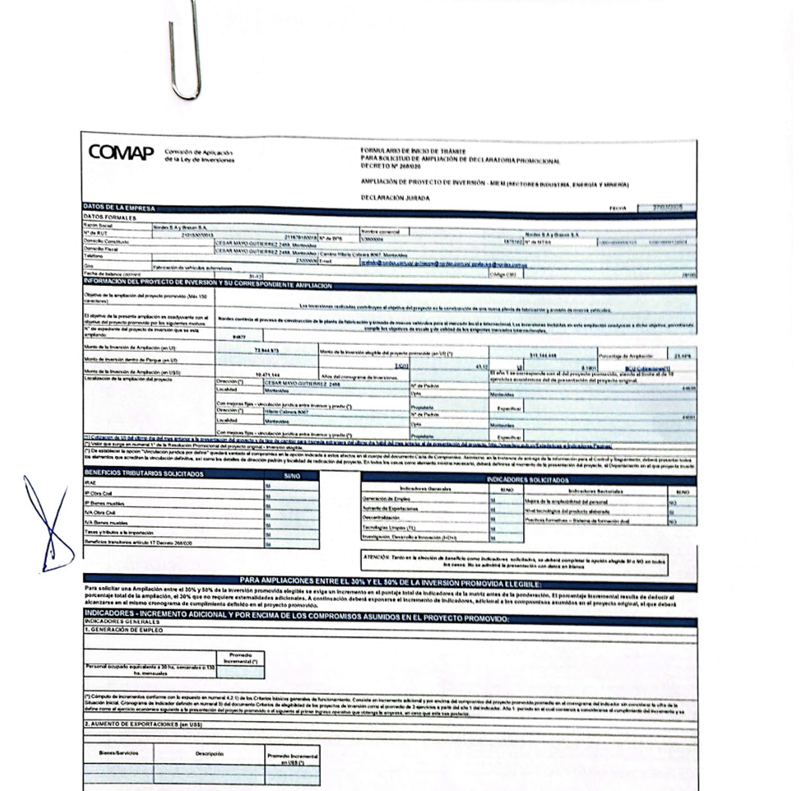{width=100%}
:::
::: {.column width="50%"}
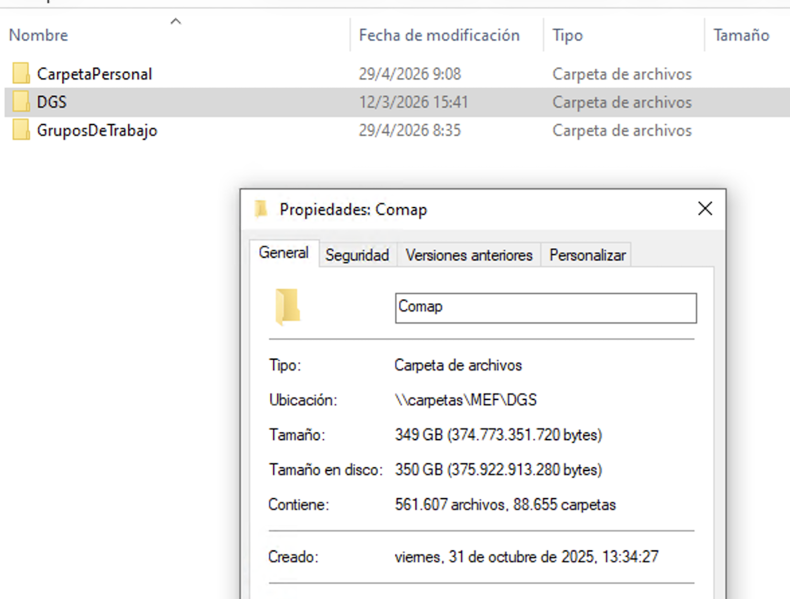{width=100%}
:::


::: {.notes}
- Gran volumen de archivos XLSX dispersos en sistema de archivos.
- Datos dispersos en:
  - Estructura de directorios
  - Metadata de los archivos (nombres, fecha modificación, nombres de hojas)
  - Celdas de Excel 
- Múltiples versiones de una planilla para un mismo formulario.
- Criterios de registro de información cambia (definición de variables en los formularios).

:::


## Características del sistema

- Observabilidad
  - ¿Qué pasó con este formulario?
- Trazabilidad
  - ¿En qué formularios se basa este indicador?
- Seguridad
  - Ambiente de desarrollo con datos reducidos.
  - Ambiente de producción en red interna MEF.


## Pipeline

::: {.column height="30%"}
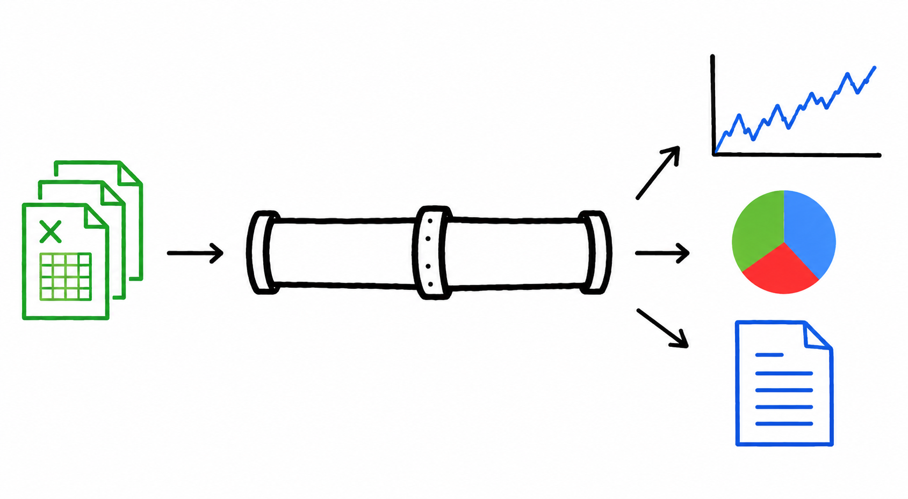{width=100%}
:::

```{mermaid}
flowchart LR
    A[Excel] --> B[R parser]
    B --> C[JSON]
    C --> D[API]
    D --> E[(PostgreSQL)]
    E --> F[Aplicación Web]
    E --> G[Tablero de Indicadores]
```

## Arquitectura


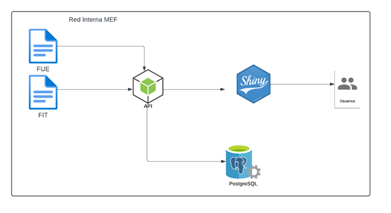{width=100%}


## Modelos de Datos 

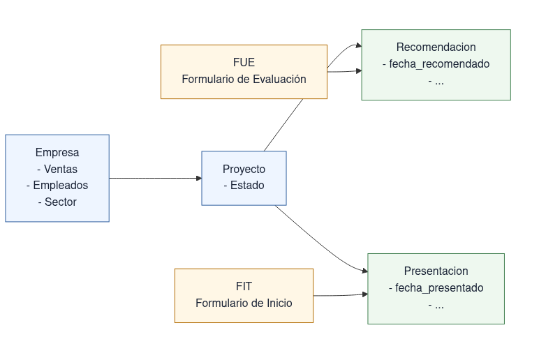{width=100%}

## Pipeline (1): Descubrir archivos

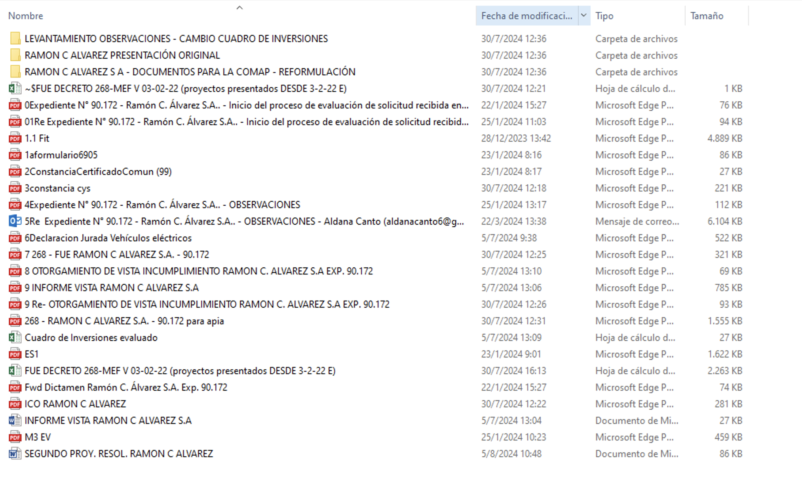{width=100%}


::: {.notes}
El primer paso es identificar y clasificar archivos, no todavía interpretar su contenido. También se registra procedencia para auditoría y para poder depurar errores aguas abajo.
:::


## Parsear 
::: {.column width="50%"}
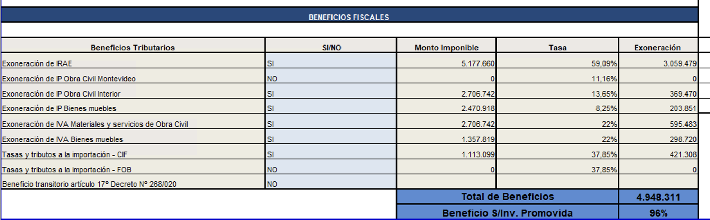{width=100%}
:::
::: {.column width="50%"}
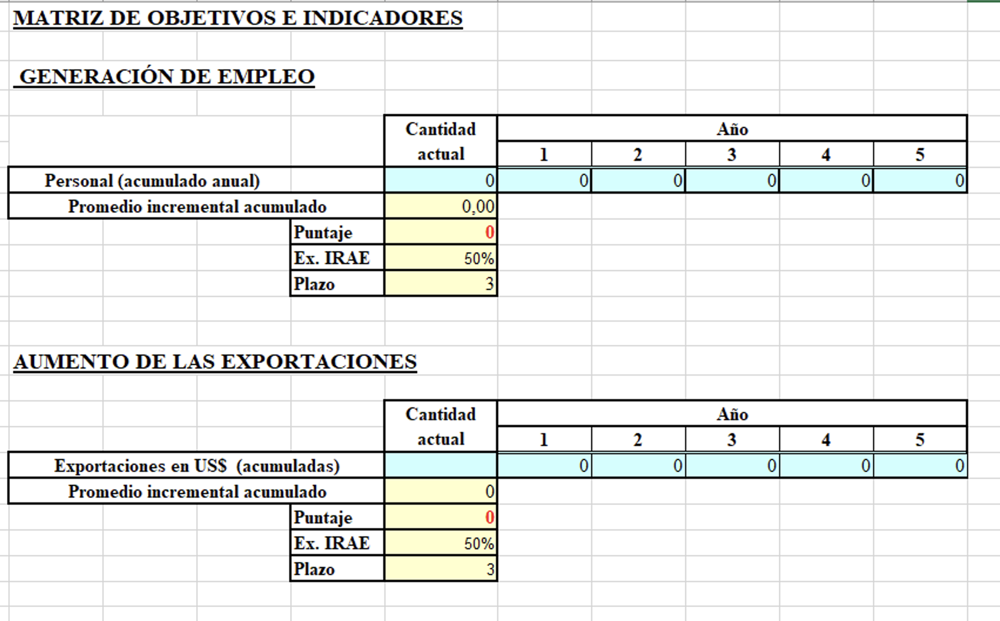{width=100%}
:::

## Parsear (2)
::: {.column width="50%"}
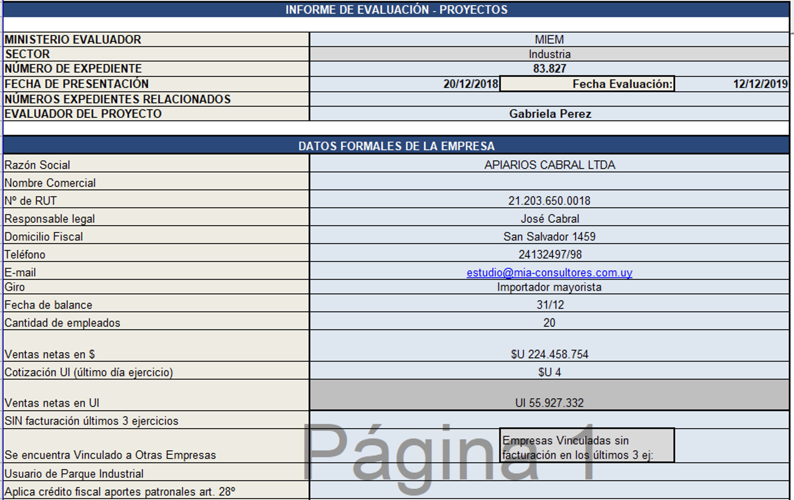{width=100%}
:::
::: {.column width="50%"}
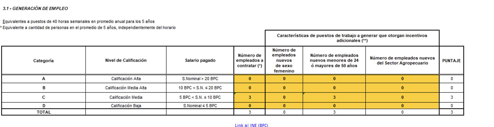{width=100%}
:::


## Postear

{width=100%}

## Consolidar

{width=100%}

## Publicar

{width=100%}


## Funcionalidades: Buscar Empresa

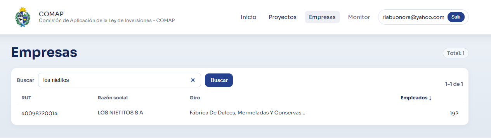{width=100%}

## Funcionalidades: Ver Empresa

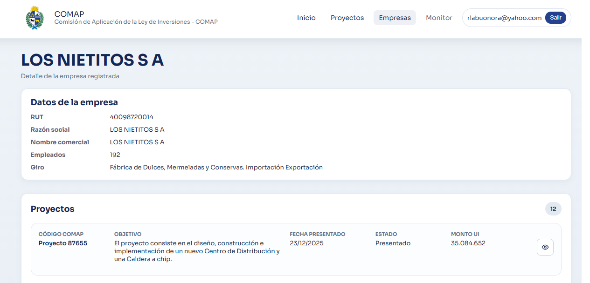{width=100%}

## Tablero

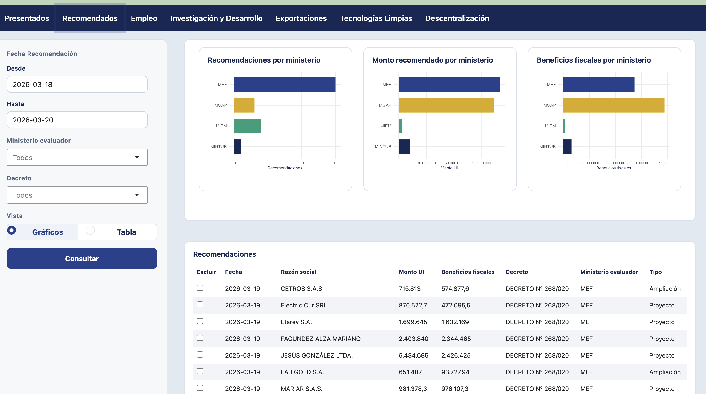{width=100%}

## Tablero (2)

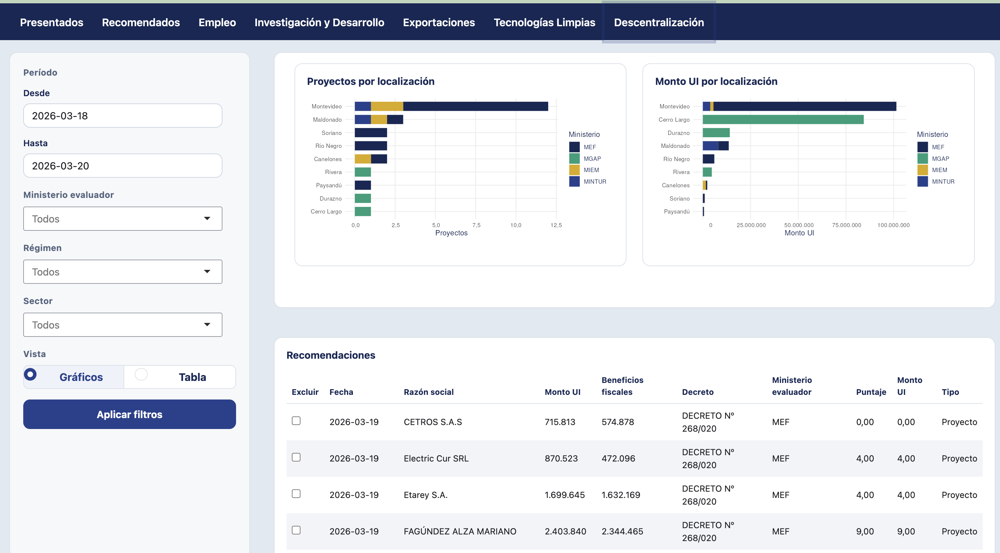{width=100%}

## Tablero (3)

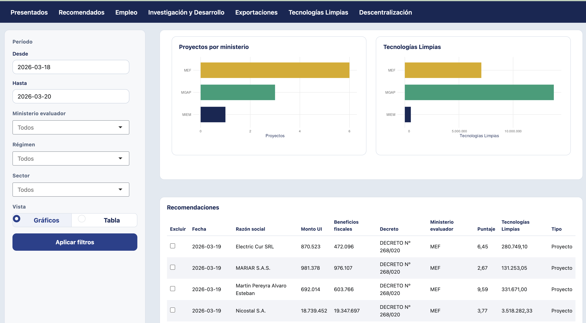{width=100%}


