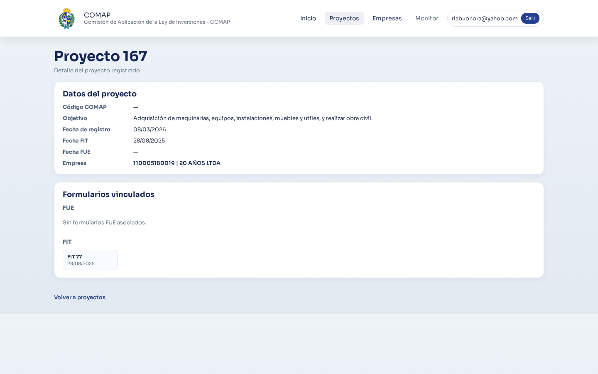

## Régimen COMAP

- Teoría del Cambio

```{mermaid}
flowchart LR

A["<span style='font-size:1.25em; font-weight:700;'>Problema Público</span><br/>• Baja inversión privada<br/>• Baja innovación<br/>• Desigualdad territorial<br/>• Baja internacionalización"]
B["<span style='font-size:1.25em; font-weight:700;'>Insumos</span><br/>• Exoneraciones fiscales<br/>• IRAE<br/>• IVA bienes de capital<br/>• Beneficios a la inversión"]
C["<span style='font-size:1.25em; font-weight:700;'>Actividades</span><br/>• Recepción de proyectos<br/>• Evaluación técnica<br/>• Asignación de puntaje<br/>• Otorgamiento de beneficios<br/>• Seguimiento de compromisos"]
D["<span style='font-size:1.25em; font-weight:700;'>Productos</span><br/>• Proyectos promovidos<br/>• Inversión comprometida<br/>• Beneficios fiscales otorgados"]
E["<span style='font-size:1.25em; font-weight:700;'>Resultados</span><br/>• Mayor inversión<br/>• Creación de empleo<br/>• Aumento de exportaciones<br/>• Adopción de tecnología<br/>• Descentralización 
territorial"]
F["<span style='font-size:1.25em; font-weight:700;'>Impactos</span><br/>• Mayor productividad<br/>• Crecimiento económico<br/>• Diversificación productiva<br/>• Desarrollo territorial
 equilibrado"]
H["<span style='font-size:1.25em; font-weight:700;'>Riesgos</span><br/>• Inversión hubiera ocurrido 
sin incentivo<br/>• Baja adicionalidad<br/>• Uso ineficiente del gasto 
tributario"]

A --> B
B --> C
C --> D
D --> E
E --> F

H -.-> E
```

## Actividades consultoría

  - Coordinación LM. Apoyo LB.
  - Relevamiento de necesidades y recursos.
  - Revisión de normativa y registros.
  - Desarrollo simulador de exoneraciones.
  - Diseño e implementación de Plataforma de monitoreo.
    - Consolidar registros históricos para analítica de proyectos basada en datos.


## Indicadores Propuestos 

- Desagregados por sector de actividad, ministerio evaluador y tamaño.

- Actividades (Procesos)
  - Proyectos pendientes de evaluación/evaluados.

- Proyectos recomendados
  - Cantidad de proyectos
  - Montos de inversión promovidos
  - Gasto tributario


## Indicadores Propuestos (2)

- Resultados:
  - Aumento de exportaciones
  - Empleo incremental
  - Descentralización
  - Inversión en I + D

## Fuentes de Información

- Gran volúmen de archivos XLSX dispersos en sistema de archivos.
- Datos dispersos en:
  - Estructura de directorios
  - Metadata de los archivos (nombres, fecha modificación, nombres de hojas)
  - Celdas de Excel 
- Múltiples versiones de una planilla para un mismo formulario.

## Arquitectura del Sistema

```{mermaid}
flowchart LR
    A[Excel] --> B[R parser]
    B --> C[JSON]
    C --> D[API]
    D --> E[(PostgreSQL)]
    E --> F[Aplicación Web]
    E --> G[Tablero de Indicadores]
```

## Pipeline de Ingesta

1. `Descubrir archivos`: detección de archivos a importar.
2. `Convertir a json`: extracción estructurada a archivos JSON por formulario.
3. `Ingerir a Postgres`: carga idempotente y normalización para consulta analítica.
4. `Publicar`: API rest para disponibilizar datos de la DB

## Características del sistema

- Entidades  clave: `Empresas`, `Proyectos`, `Fits`, `Fues`.
- Se conserva JSON crudo y ruta de XLSX para auditoría y reproceso.
- Se generan tablas normalizadas para performance analítica.

## Modelos de Datos 

```{mermaid}
flowchart LR

    PROYECTO -- "N:1" --> EMPRESA
    FIT -- "1:1" --> PROYECTO
    FUE -- "1:1" --> PROYECTO
    CONTROL_SEGUIMIENTO -- "N:1" --> PROYECTO


```

## Estado actual del proyecto

Versión 0 de todos los componentes desarrollados.

## Aplicación 


## Búsqueda por Empresas


## Inspeccionar proyectos



## Inspeccionar formularios


## Tablero


## Próximos Pasos: Versión 1

- Despliegue en red MEF de Versión 1 con datos 2025.
- Desarrollo de pantallas del tablero faltantes:
  - Beneficios Fiscales
  - Empleo
  - Exportaciones
  - Descentralización
  - I + D


## Próximos Pasos: Versión 2:
  - Mejora en el proceso de ingesta:
    - Importar campos adicionales (cuadro detallado de inversiones)
    - Mejora en la deduplicación de formularios
    - Incorporación de planillas de Control y Seguimiento
  - Mejora en reporte de calidad y diccionario de datos.
  - Diseño y desarrollo del tablero.
    - Datos detallados de indicadores de proyectos (empleo, etc.)
  - Desarrollo de búsquedas y consultas adicionales.
  - Interconexión con VUI.


## Referencias

- Llambí, C., Rius, A., Carrasco, P., Carbajal, F., y Cazulo, P. (2014).  
*Una evaluación de los incentivos fiscales a la inversión en Uruguay*.  
Montevideo: Centro de Estudios Fiscales.

- República Oriental del Uruguay. (2025). *Decreto N.º 329/025: Régimen de promoción de inversiones*.  
Ministerio de Economía y Finanzas.  
https://www.gub.uy/ministerio-economia-finanzas/politicas-y-gestion/regimen-decreto-329025
