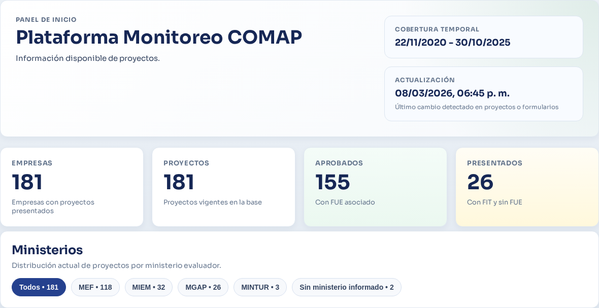
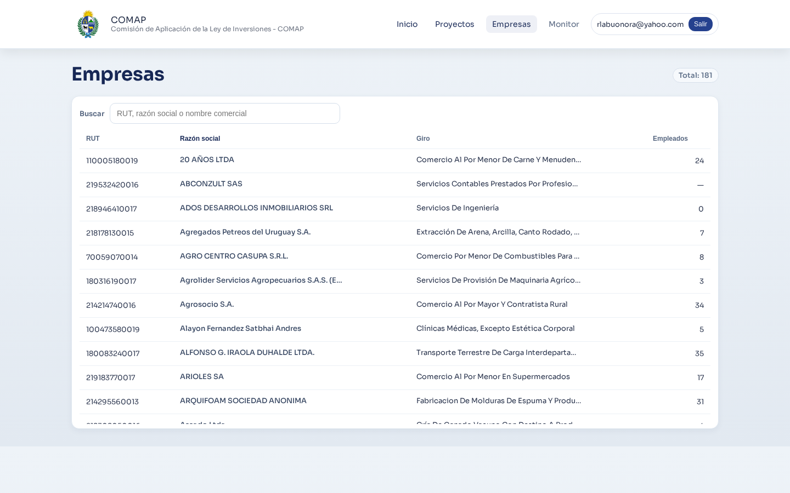
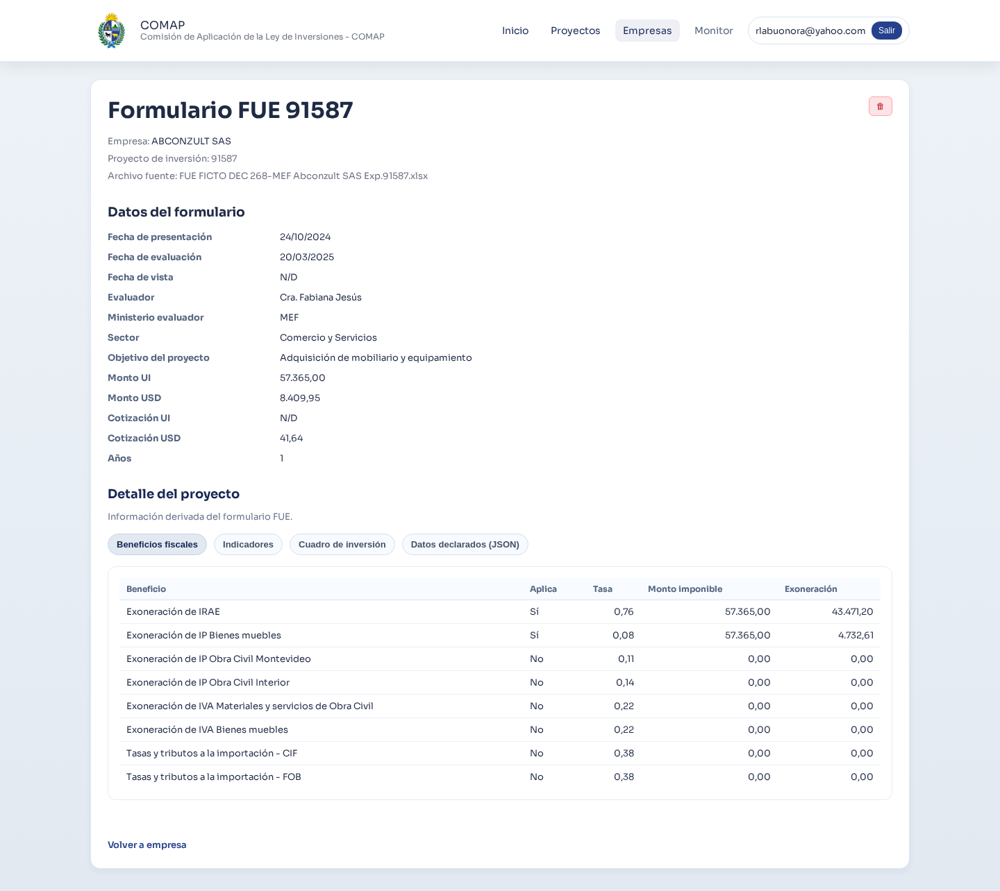
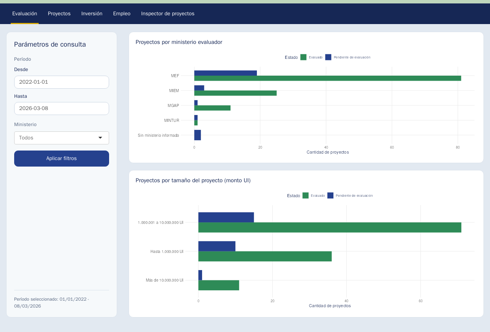
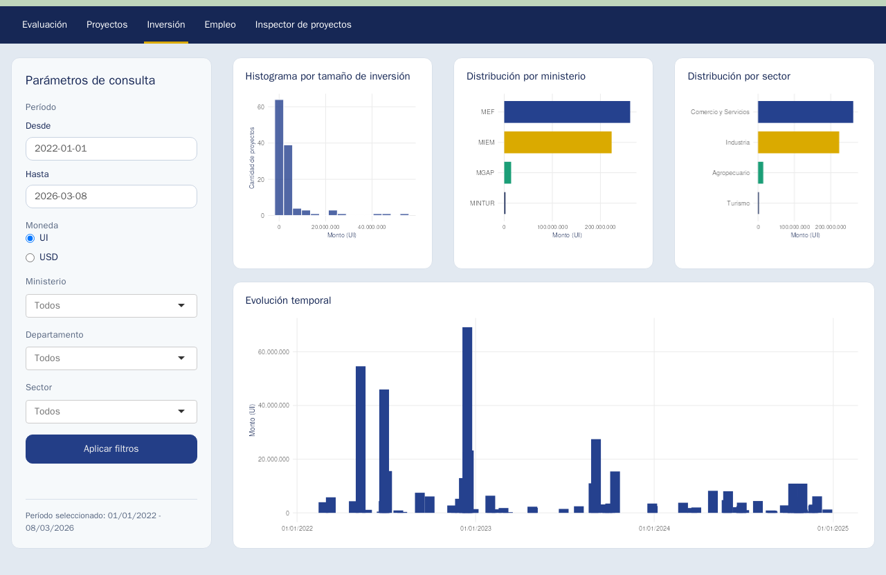

## Objetivo

- Desarrollar una herramienta informática para automatizar el monitoreo del régimen de promoción de inversiones.


## Actividades consultoría

  - Coordinación LM. Apoyo LB.
  - Relevamiento de necesidades y recursos.
  - Revisión de normativa y registros.
  - Diseño e implementación de Plataforma de Monitoreo.
    - Consolidar registros históricos para analítica de proyectos basada en datos.
  - Desarrollo simulador de exoneraciones.

::: {.notes}
Mostrar que el trabajo combinó relevamiento, comprensión normativa y desarrollo. Destacar que la plataforma de monitoreo requirió primero ordenar y entender la información existente.
:::

<!--

## Régimen COMAP

- Teoría del Cambio

```{mermaid}
flowchart LR

A["<span style='font-size:1.25em; font-weight:700;'>Problema Público</span><br/>• Baja inversión privada<br/>• Baja innovación<br/>• Desigualdad territorial<br/>• Baja internacionalización"]
B["<span style='font-size:1.25em; font-weight:700;'>Insumos</span><br/>• Exoneraciones fiscales<br/>• IRAE<br/>• IVA bienes de capital<br/>• Beneficios a la inversión"]
C["<span style='font-size:1.25em; font-weight:700;'>Actividades</span><br/>• Recepción de proyectos<br/>• Evaluación técnica<br/>• Asignación de puntaje<br/>• Otorgamiento de beneficios<br/>• Seguimiento de compromisos"]
D["<span style='font-size:1.25em; font-weight:700;'>Productos</span><br/>• Proyectos promovidos<br/>• Inversión comprometida<br/>• Beneficios fiscales otorgados"]
E["<span style='font-size:1.25em; font-weight:700;'>Resultados</span><br/>• Mayor inversión<br/>• Creación de empleo<br/>• Aumento de exportaciones<br/>• Adopción de tecnología<br/>• Descentralización 
territorial"]
F["<span style='font-size:1.25em; font-weight:700;'>Impactos</span><br/>• Mayor productividad<br/>• Crecimiento económico<br/>• Diversificación productiva<br/>• Desarrollo territorial
 equilibrado"]
H["<span style='font-size:1.25em; font-weight:700;'>Riesgos</span><br/>• Inversión hubiera ocurrido 
sin incentivo<br/>• Baja adicionalidad<br/>• Uso ineficiente del gasto 
tributario"]

A --> B
B --> C
C --> D
D --> E
E --> F

H -.-> E
```

::: {.notes}
Usar esta lámina para recordar la teoría del cambio del régimen. El mensaje principal es que el monitoreo debe cubrir no solo trámites y proyectos, sino también resultados e impactos esperados.
:::


## Indicadores Propuestos (1)

- Desagregados por:
 - Sector de actividad
 - Ministerio evaluador
 - Tamaño de la empresa

- Actividades (Procesos)
  - Proyectos pendientes de evaluación/evaluados.
  - Evaluaciones (comparar datos presentado con datos evaluados)
  - Control y seguimiento

::: {.notes}
Explicar que esta primera familia de indicadores es de gestión operativa. Sirve para responder cómo está funcionando el proceso administrativo y dónde se acumulan cuellos de botella.
:::

## Indicadores Propuestos (2)

- Productos
  - Cantidad de proyectos
  - Montos de inversión promovidos
  - Gasto tributario

::: {.notes}
Aquí ya se mide output del régimen. Son indicadores relativamente más accesibles con los datos actuales y sirven como puente entre actividad administrativa y evaluación de resultados.
:::


## Indicadores Propuestos (3)

- Resultados:
  - Aumento de exportaciones
  - Empleo incremental
  - Descentralización
  - Inversión en I + D

::: {.notes}
Marcar la diferencia entre productos y resultados. Estos indicadores exigen mejor cobertura y series consistentes, por eso aparecen como una meta natural de maduración del sistema.
:::

-->

## Fuentes de Información

- Gran volumen de archivos XLSX dispersos en sistema de archivos.
- Datos dispersos en:
  - Estructura de directorios
  - Metadata de los archivos (nombres, fecha modificación, nombres de hojas)
  - Celdas de Excel 
- Múltiples versiones de una planilla para un mismo formulario.
- Criterios de registro de información cambia (definición de variables en los formularios).

::: {.notes}
Las joyas de la corona.
:::


## Características del sistema

- Observabilidad
  - ¿Qué pasó con este formulario?
- Trazabilidad
  - ¿En qué formularios se basa este indicador?
- Seguridad
  - Ambiente de desarrollo con datos reducidos.
  - Ambiente de producción en red interna MEF.


## Arquitectura del Sistema

```{mermaid}
flowchart LR
    A[Excel] --> B[R parser]
    B --> C[JSON]
    C --> D[API]
    D --> E[(PostgreSQL)]
    E --> F[Aplicación Web]
    E --> G[Tablero de Indicadores]
```


## Modelos de Datos 

```{mermaid}
flowchart LR

    PROYECTO -- "N:1" --> EMPRESA
    FIT -- "1:1" --> PROYECTO
    FUE -- "1:1" --> PROYECTO
    CONTROL_SEGUIMIENTO -- "N:1" --> PROYECTO
    PUNTAJES["PUNTAJES<br/>• Empleo<br/>• Exportaciones<br/>• I+D"] --> FUE
    CUADRO_INVERSIONES --> FUE

```

## Pipeline (1): Descubrir archivos

```json

 {
      "path_rel": "3 - MARZO 2025/REUNIÓN 20 03 2025/MGAP/268  - XXX, YYY, ZZZ  y Otros - 91.201 - FICTO/C1/1 Doc Formales/1 FIT MGAP XXXX XXX 24.xlsx",
      "filename": "1 FIT MGAP XXXX YYYY 24.xlsx",
      "ext": ".xlsx",
      "mtime_iso": "2024-06-25T15:09:34Z",
      "provenance": {
        "excel_creator": "marismendi",
        "excel_last_modified_by": "Usuario",
        "excel_modified_at": "2024-06-25T00:00:00Z",
      },
      "classification": {
        "form_type": "fit",
        "confidence": 0.7,
        "reason": "Coincide con reglas de FIT por nombre de archivo.",
        "matched_patterns": ["(?i)\\bfit\\b", "(?i).+"]
      },
      "import": {
        "should_import": true,
      }
	    }
```

::: {.notes}
El primer paso es identificar y clasificar archivos, no todavía interpretar su contenido. También se registra procedencia para auditoría y para poder depurar errores aguas abajo.
:::

## Pipeline (2): Convertir a formato intermedio

```json

{
  "bps": null,
  "rut": "12345678910111",
  "ciiu": "69201",
  "giro": "Servicios contables prestados por Profesionales Independientes",
  "mtss": null,
  "anios": 1,
  "grupo": false,
  "correo": "info@xxxxxxx.com",
  "sector": "Comercio y Servicios",
  "monto_ui": 57365,
  "objetivo": "Adquisición de mobiliario y equipamiento",
  "telefono": "91055055",
  "contactos": [
    {
      "cedula": "",
      "correo": "info@xxxxx.com",
      "nombre": "Nombre Apellido",
      "telefono": "123456",
      "direccion": ""
    }
  ],
  "evaluador": "Cra. XXXXXX",
  "monto_usd": 8409.9515,
  "ventas_ui": null,
  "beneficios": {
    "irae": true,
    "tasas": false,
    "ip_civil": false,
    "iva_muebles": false,
    "ip_inmuebles": true,
    "transitorios": false,
    "iva_obra_civil": false
  },
  "controlada": false,
  "fecha_vista": null,
  "indicadores": [
    {
      "puntaje": 10,
      "indicador": "empleo",
      "ponderacion": 0.5,
      "puntaje_final": 5
    },
    {
      "puntaje": 0,
      "indicador": "exportaciones",
      "ponderacion": 0.2,
      "puntaje_final": 0
    },
    {
      "puntaje": 4,
      "indicador": "descentralizacion",
      "ponderacion": 0.15,
      "puntaje_final": 0.6
    },
    {
      "puntaje": 0,
      "indicador": "tecnologias_limpias",
      "ponderacion": 0.2,
      "puntaje_final": 0
    },
    {
      "puntaje": 0,
      "indicador": "i_d",
      "ponderacion": 0.2,
      "puntaje_final": 0
    },
    {
      "puntaje": 0,
      "indicador": "sectorial",
      "ponderacion": 0.25,
      "puntaje_final": 0
    }
  ],
  "monto_parque": null,
  "razon_social": "Empresa S.A.S.",
  "ventas_pesos": null,
  "cotizacion_ui": null,
  "empresa_nueva": false,
  "fecha_balance": "2025-10-31",
  "cotizacion_usd": 41.64,
  "localizaciones": [
    {
      "padron": null,
      "direccion": "Calle 6192",
      "localidad": "Montevideo",
      "departamento": "Montevideo"
    }
  ],
  "cuadro_inversion": {
    "Maquinarias y equipos": 0,
    "Obra Civil (Leyes Sociales)": 0,
    "SUB-TOTAL INVERSIÓN ELEGIBLE": 57365,
    "TOTAL DE INVERSIONES PROMOVIDAS": 57365,
    "Maquinarias y equipos (nacional)": 57365,
    "SUB-TOTAL INVERSIÓN NO ELEGIBLE": 0,
    "Maquinaria y equipos (importados)": 0,
    "Imprevistos - Maquinarias y equipos": 0,
    "Obra Civil (Materiales y Servicios)": 0,
    "Imprevistos - Obra Civil (Leyes Sociales)": 0,
    "Obra Civil Interior (Materiales y Servicios)": 0,
    "Obra Civil Montevideo (Materiales y Servicios)": 0,
    "Imprevistos (10%) - Obra Civil (Leyes Sociales)": 0,
    "Imprevistos - Obra Civil (Materiales y Servicios)": 0,
    "Maquinaria y equipos (no gravados/exentos para IVA)": 0,
    "Imprevistos (10%) - Maquinarias y equipos (nacional)": 0,
    "Imprevistos (10%) - Maquinaria y equipos (importados)": 0,
    "Imprevistos (10%) - Obra Civil (Materiales y Servicios)": 0,
    "Imprevistos (10%) - Maquinaria y equipos (no gravados/exentos para IVA)": 0,
    "Obra Civil Interior (Leyes Sociales, Mano de obra propia - Sueldos, Bienes y Servicios importados que integran la Obra Civil que se exoneraron por tributos a la importación )": 0,
    "Obra Civil Montevideo (Leyes Sociales, Mano de obra propia - Sueldos, Bienes y Servicios importados que integran la Obra Civil que se exoneraron por tributos a la importación )": 0
  },
  "domicilio_fiscal": "Calle 6192",
  "fecha_evaluacion": "2025-03-20",
  "nombre_comercial": "Empresa S.A.S.",
  "source_file_path": "/home/opp/dev/comap_data/4 - ABRIL 2025/REUNION 24.04.2025/MEF/FICTOS/268 - XXXX S.A.S. EXP. 91.587 (FICTO)/FUE FICTO DEC 268-MEF XXXX SAS Exp.91587.xlsx",
  "numero_expediente": "91587",
  "responsable_legal": "Nombre Apellido",
  "cantidad_empleados": null,
  "contribuyente_irae": null,
  "fecha_presentacion": "2024-10-24",
  "tipo_contribuyente": null,
  "beneficios_fiscales": {
    "Exoneración de IRAE": {
      "tasa": 0.7578,
      "aplica": true,
      "exoneracion": 43471.197,
      "monto_imponible": 57365
    },
    "Exoneración de IP Bienes muebles": {
      "tasa": 0.0825,
      "aplica": true,
      "exoneracion": 4732.6125,
      "monto_imponible": 57365
    },
    "Exoneración de IVA Bienes muebles": {
      "tasa": 0.22,
      "aplica": false,
      "exoneracion": 0,
      "monto_imponible": 0
    },
    "Exoneración de IP Obra Civil Interior": {
      "tasa": 0.1365,
      "aplica": false,
      "exoneracion": 0,
      "monto_imponible": 0
    },
    "Exoneración de IP Obra Civil Montevideo": {
      "tasa": 0.1116,
      "aplica": false,
      "exoneracion": 0,
      "monto_imponible": 0
    },
    "Tasas y tributos a la importación - CIF": {
      "tasa": 0.3785,
      "aplica": false,
      "exoneracion": 0,
      "monto_imponible": 0
    },
    "Tasas y tributos a la importación - FOB": {
      "tasa": 0.3785,
      "aplica": false,
      "exoneracion": 0,
      "monto_imponible": 0
    },
    "Exoneración de IVA Materiales y servicios de Obra Civil": {
      "tasa": 0.22,
      "aplica": false,
      "exoneracion": 0,
      "monto_imponible": 0
    }
  },
  "ministerio_evaluador": "MEF"
}
```

## Pipeline (3) Normalizar y persistir en Base de Datos



## Consultas y Búsquedas para gestión diaria

:::: {.columns}

::: {.column width="35%"}
- ¿Cuántos proyectos tiene la empresa X?
- ¿Está al día con control y seguimiento?
:::

::: {.column width="65%"}

:::

::::


## Inspección de formularios



::: {.notes}
Esta vista sirve para validación y control de calidad. Permite bajar desde la consulta agregada al detalle del formulario procesado y contrastar contra la fuente.
:::


## Pipeline (5) Análisis



## Análisis 



## Análisis (2)


## Estado actual del proyecto

- Versión 0 de todos los componentes desarrollados.
- Muestra reducida de formularios recientes (FIT, FUE, FIT Ampliación)
- Validar arquitectura, flexibilidad y agilidad. 
- Trazabilidad y Observabilidad permiten iterar rápido sin perder confianza de los usuarios.


## Versión 1

- Despliegue en red MEF de Versión 1 con datos 2025.
- Desarrollo de pantallas del tablero faltantes:
  - Beneficios Fiscales
  - Empleo
  - Exportaciones
  - Descentralización
  - I + D


## Versión 1.1:
  - Mejora en el proceso de ingesta:
    - Ampliación de formatos de formularios (Control y Seguimiento, Decretos anteriores FIT, FUE)
    - Importar campos adicionales (cuadro detallado de inversiones)
    - Mejora en la desduplicación de formularios
  - Mejora en reporte de calidad y diccionario de datos, homogeneización de series de tiempo
  - Diseño y desarrollo del tablero.
    - Datos detallados de indicadores de proyectos (empleo, etc.)
  - Interconexión con VUI.


<!--
## Referencias

- Llambí, C., Rius, A., Carrasco, P., Carbajal, F., y Cazulo, P. (2014).  
*Una evaluación de los incentivos fiscales a la inversión en Uruguay*.  
Montevideo: Centro de Estudios Fiscales.

- República Oriental del Uruguay. (2025). *Decreto N.º 329/025: Régimen de promoción de inversiones*.  
Ministerio de Economía y Finanzas.  
https://www.gub.uy/ministerio-economia-finanzas/politicas-y-gestion/regimen-decreto-329025

-->
